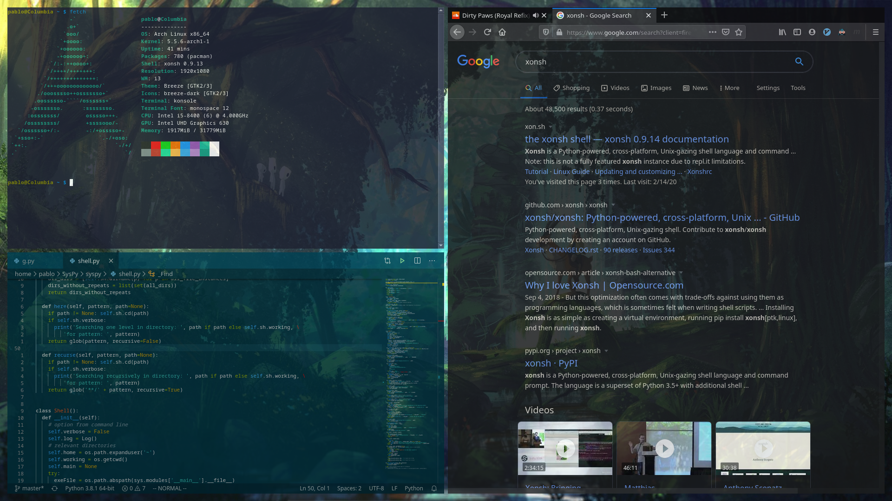

### System Configuration


### Packages to Install
[install notes](.rsrc/arch_install_guidelines.md)
* install yay somehow
> yay -Sy shadowfox-updater

### Inspired by this [In-depth Guide to tracking dotfiles](https://developer.atlassian.com/blog/2016/02/best-way-to-store-dotfiles-git-bare-repo/)

### Sparknotes
* Starting from scratch
```
git init --bare $HOME/.unx
alias g='/usr/bin/git --git-dir=$HOME/.unx/ --work-tree=$HOME'
g config --local status.showUntrackedFiles no
```

* Take to a new system
```
alias g='/usr/bin/git --git-dir=$HOME/.unx/ --work-tree=$HOME'
echo ".unx" >> .gitignore
git clone --bare 'https://github.com/mrgarelli/unix.git' $HOME/.unx
g checkout
g config --local status.showUntrackedFiles no
```
